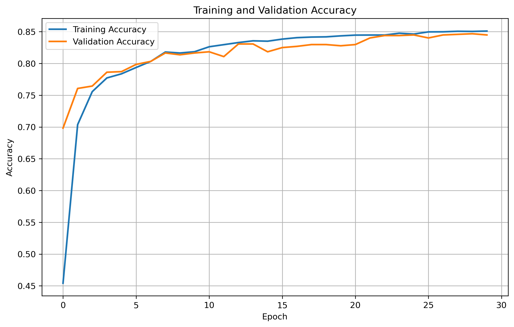
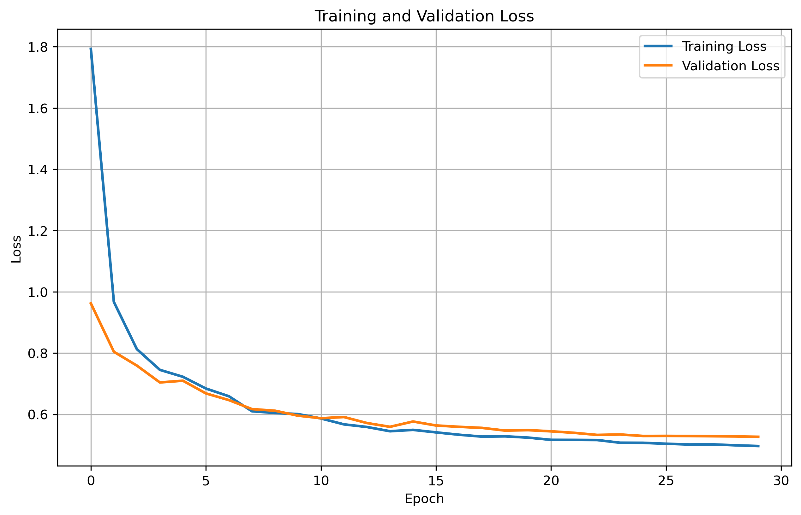
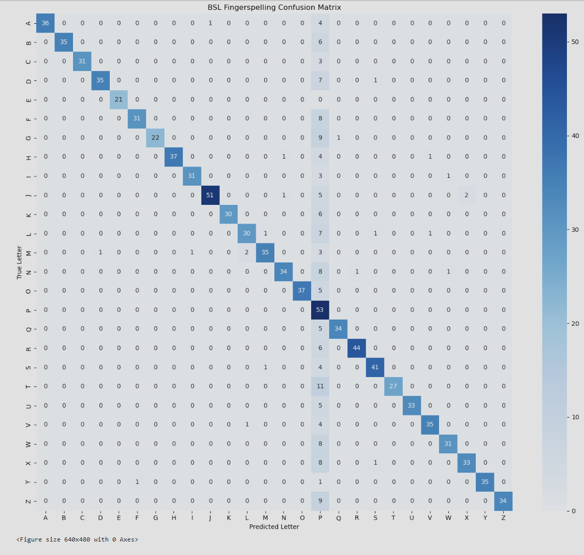

# British Sign Language Fingerspelling Recognition using Bidirectional LSTM

A deep-learning project for recognising **British Sign Language (BSL) fingerspelling gestures from video** using MediaPipe hand landmarks and a Bidirectional Long Short-Term Memory (BiLSTM) neural network.

The system processes hand movements across consecutive video frames, classifies BSL alphabet gestures from **A-Z**, and includes both real-time webcam inference and a Flask-based video prediction demo.

---

## Project Overview

The project investigates the use of Artificial Neural Networks for recognising British Sign Language alphabet gestures.

An initial image-based CNN approach was explored, but static images were limited when distinguishing gestures that depend on movement or have visually similar hand positions.

The final approach therefore uses:

**Video → MediaPipe hand landmarks → temporal sequences → Bidirectional LSTM → predicted BSL letter**

MediaPipe Hands extracts the 3D coordinates of 21 landmarks from each hand. Up to two hands are represented, producing:

`2 hands × 21 landmarks × 3 coordinates = 126 features per frame`

Ten consecutive frames are combined to create a model input with shape:

`(10, 126)`

---

## Model Architecture

The final model uses a Bidirectional LSTM architecture:

```text
Input: 10 frames × 126 features
            ↓
Bidirectional LSTM - 128 units
            ↓
Dropout - 0.4
            ↓
Bidirectional LSTM - 64 units
            ↓
Dropout - 0.3
            ↓
Dense - 64 units
            ↓
Softmax Output - 26 classes (A-Z)
```

The model contains approximately **435,000 trainable parameters**.

---

## Dataset and Preprocessing

The final dataset consists of controlled video recordings representing the **26 BSL alphabet gestures from A-Z**.

During preprocessing:

- MediaPipe Hands detects up to two hands in each video frame.
- 21 landmarks are extracted from each hand using x, y and z coordinates.
- Landmark positions are normalised relative to the wrist.
- Missing hands are represented using zero padding.
- Each frame is converted into 126 numerical features.
- Overlapping sequences of 10 consecutive frames are generated.

The preprocessing pipeline generated:

**10,569 sequences**

Each sequence has the shape:

```text
(10, 126)
```

Dataset quality checks confirmed:

```text
Files with incorrect shape: 0
Files containing missing values: 0
```

The generated `.npy` sequence files are excluded from the repository because they can be recreated from the source videos using the preprocessing notebook.

---

## Model Performance

The best model checkpoint was selected using validation accuracy and then evaluated on a separate held-out test set.

| Metric | Result |
|---|---:|
| Test Accuracy | **84.77%** |
| Best Validation Accuracy | **84.67%** |
| Macro F1-score | **0.88** |
| Weighted F1-score | **0.88** |

Performance was strong across many of the alphabet classes.

The confusion matrix showed that the model occasionally confused visually similar gestures and demonstrated a tendency to over-predict the letter **P**. This resulted in high recall but comparatively low precision for that class.

---

## Training Performance

### Accuracy



### Loss



Training and validation performance remained relatively close throughout training, with both loss curves decreasing steadily.

---

## Confusion Matrix



The confusion matrix provides a class-level view of the model's predictions across the 26 BSL alphabet gestures.

---

## Real-Time Prediction

The notebook also includes real-time webcam inference.

The live prediction pipeline is:

```text
Webcam frame
      ↓
MediaPipe Hands
      ↓
Landmark extraction
      ↓
10-frame sequence
      ↓
Bidirectional LSTM
      ↓
Predicted BSL letter
```

The predicted letter and model confidence are displayed directly on the webcam feed.

---

## Flask Demo Application

A lightweight Flask application is included to demonstrate video-based inference.

Users can upload a short BSL gesture video and receive:

```text
Predicted Letter
+
Prediction Confidence
```

The application uses the same MediaPipe landmark preprocessing approach used during model development.

To run the application locally:

```bash
cd app
python app.py
```

Then open:

```text
http://127.0.0.1:5000
```

in a web browser.

---

## Project Structure

```text
bsl-fingerspelling-recognition/
│
├── app/
│   ├── app.py
│   ├── inference.py
│   └── templates/
│       └── index.html
│
├── data/
│   ├── videos/
│   └── processed_sequences/
│
├── models/
│   ├── bsl_lstm_best_model.h5
│   ├── final_bsl_lstm_model.h5
│   └── label_encoder.pkl
│
├── notebooks/
│   └── bsl_model_development.ipynb
│
├── results/
│   ├── confusion_matrix.png
│   ├── training_accuracy.png
│   ├── training_loss.png
│   └── learning_rate_decay.png
│
├── .gitignore
├── requirements.txt
└── README.md
```

---

## Installation

Clone the repository:

```bash
git clone https://github.com/diyakapoorr/bsl-fingerspelling-recognition.git
cd bsl-fingerspelling-recognition
```

Install the required Python packages:

```bash
pip install -r requirements.txt
```

The main dependencies include TensorFlow, MediaPipe, OpenCV, NumPy, scikit-learn, Matplotlib, Seaborn and Flask.

---

## Notebook

The complete model-development workflow is available in:

```text
notebooks/bsl_model_development.ipynb
```

The notebook covers:

- Dataset validation
- Hand landmark extraction
- Video preprocessing
- Sequence generation
- Dataset quality checks
- BiLSTM model training
- Model evaluation
- Classification report
- Confusion matrix
- Training curves
- Real-time webcam inference

---

## Limitations

This project was developed as a prototype using controlled recordings.

The dataset contains one source recording for each BSL letter, from which overlapping 10-frame sequences were generated. Because neighbouring sequences may contain many of the same frames, there is a risk that highly similar sequences can appear across the training, validation and test splits.

The reported test accuracy should therefore be interpreted as performance on the current experimental dataset rather than as a direct estimate of performance on completely unseen signers.

---

## Future Improvements

Future development could include:

- Collecting BSL gestures from multiple signers.
- Using independent source videos for training and testing.
- Evaluating signer-independent model performance.
- Increasing the number and diversity of examples for each gesture.
- Improving temporal prediction smoothing.
- Extending the model from individual letters to complete words.
- Adding BSL number gestures.
- Investigating attention-based temporal models further.
- Optimising the system for lightweight or edge-device deployment.

---

## Technologies

**Python · TensorFlow · Keras · MediaPipe · OpenCV · NumPy · scikit-learn · Flask · Matplotlib · Seaborn**

---

## Author

**Diya Kapoor**

BSc (Hons) Artificial Intelligence
